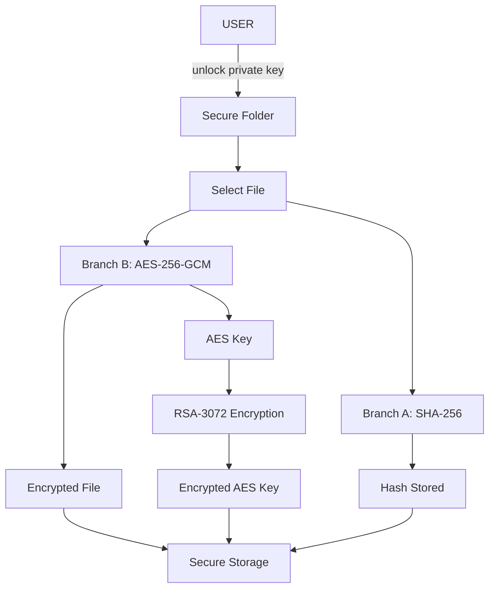
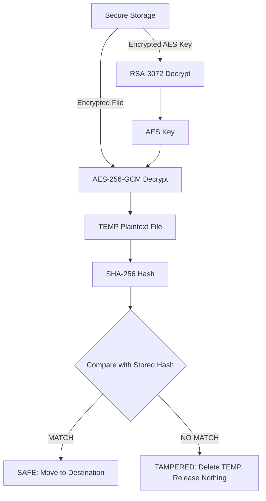

# Cryptix: Secure Folder System

Cryptix is a highly secure, local-first folder and file encryption application designed specifically for Windows. It provides a robust vault for sensitive data, ensuring that files are encrypted with unique AES-256-GCM keys, wrapped with RSA-3072, and hashed using SHA-256 for strict tamper-detection.

It features a vibrant, modern web interface served locally, providing a seamless "Secure Storage" experience without compromising on security.

## Cryptography Roles
| Algorithm | Role in Cryptix |
| :--- | :--- |
| **AES-256-GCM** | Encrypts and decrypts the actual file data in 1 MiB streaming chunks. |
| **RSA-3072 (OAEP)** | Encrypts the random AES key for each file using the user's public key. |
| **SHA-256** | Generates a hash of the original plaintext file, used strictly to verify integrity upon decryption. |

## Flow Diagrams

### 1. Encryption Flow


### 2. Decryption & Verification Flow


## Windows Setup
Cryptix is designed for Windows and requires Python 3.9+.

**Using PowerShell or Command Prompt:**
```bash
# 1. Clone or download the repository
cd cryptix

# 2. Create a virtual environment
python -m venv venv
.\venv\Scripts\activate

# 3. Install requirements
pip install -r requirements.txt
```

## How to Run

### Web Interface (Recommended)
Start the local Flask server and open the UI in your default browser:
```bash
python app_web.py
```
*The app will automatically bind to a free port on `127.0.0.1` and open `http://127.0.0.1:5000` (or similar).*

### CLI Usage
You can also run Cryptix entirely from the command line:
```bash
# Initialize a new vault
python app_cli.py init

# Encrypt a file or folder
python app_cli.py encrypt C:\Path\To\Your\Data

# Decrypt the vault
python app_cli.py decrypt C:\Path\To\Output
```

## Screenshots
*(Screenshots of the UI go here. The interface features a deep midnight background with glowing gradient cards, a custom folder browser, and interactive pipeline traces).*

## Security Design Summary
- **Local Only:** The web server strictly binds to `127.0.0.1`. The application enforces `Host` and `Origin` headers and uses CSRF tokens on all state-changing requests. There are zero external network requests (no CDNs).
- **Anti-Tampering:** Every file is verified with SHA-256 upon decryption. If a single byte is changed, the AES-GCM tag check or the SHA-256 hash check will fail, and the file is permanently dropped (never released to the user).
- **No Plaint-text Leaks:** Original filenames are never stored in plaintext on disk; they are encrypted inside `meta.json`.
- **Session Security:** The private key is held in memory only while unlocked. The session automatically locks after 5 minutes of inactivity or upon failed attempts. Failed unlocking attempts result in an exponentially backing-off delay to prevent brute-forcing.
- **Modern Crypto APIs:** We use `cryptography`'s primitives explicitly. `backend=` is omitted (defaulting to the modern OpenSSL backend), and older standards like PKCS1v15, ECB, or CBC are strictly avoided.

## Known Limitations
> [!WARNING]
> Please read these limitations carefully before trusting Cryptix with critical data.

1. **Unrecoverable Data:** A forgotten passphrase or a lost `private.pem` file means your data is permanently unrecoverable. There are no backdoors.
2. **Malware Susceptibility:** Cryptix provides at-rest encryption. It cannot protect against keyloggers or malware on a machine while the vault is actively unlocked.
3. **SSD Secure-Delete Caveat:** If you choose to "Delete originals after encryption", Cryptix uses OS-level deletion. Due to wear-leveling on modern SSDs, physical destruction of the underlying plaintext blocks cannot be guaranteed.
4. **Local Single-User Only:** The application is meant for one local user. It must never be exposed to a public network (`0.0.0.0`).
5. **RSA Wrapping Only:** RSA is used strictly to wrap the random AES keys. It is never used to encrypt file data directly.
